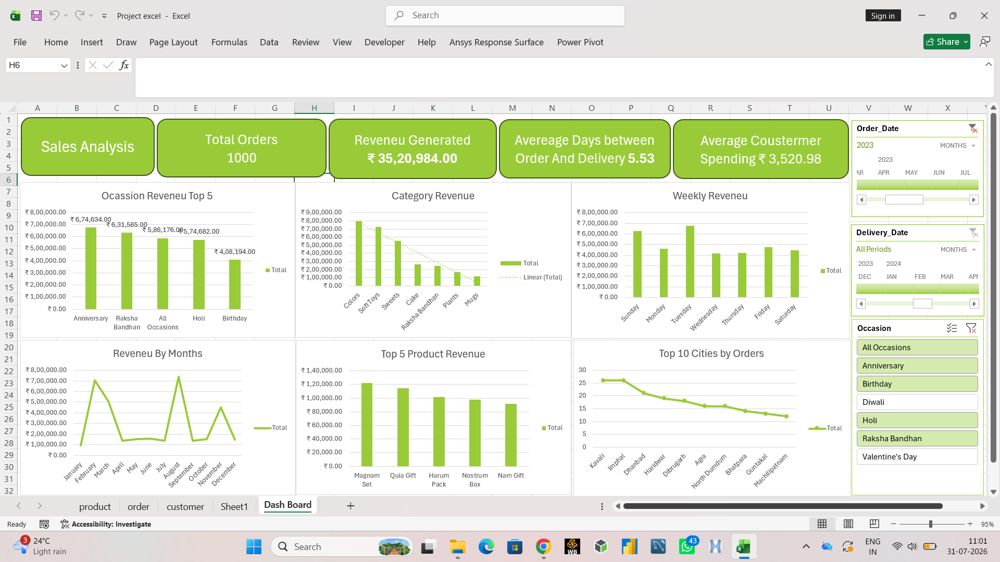

# 📊 Sales Analysis Dashboard in Microsoft Excel

## 📌 Project Overview

This project is an interactive **Sales Analysis Dashboard** created using Microsoft Excel. It provides insights into sales performance, customer purchasing behavior, product revenue, and order trends through interactive visualizations.

The dashboard allows users to filter data dynamically using slicers and quickly understand business performance through KPI cards and charts.

---

# Dashboard Preview

> Add your dashboard screenshot below.



---

# Project Objectives

- Analyze overall sales performance
- Track revenue generated
- Identify top-selling products
- Analyze sales by occasion and category
- Monitor weekly and monthly revenue trends
- Understand customer spending
- Identify top-performing cities

---

# Dataset

The project contains approximately **1000 order records** and includes multiple related datasets.

### Worksheets

- **Order** – Customer orders and transaction details
- **Product** – Product information
- **Customer** – Customer details
- **Sheet1** – Helper calculations
- **Dashboard** – Interactive Excel dashboard

---

# Dashboard KPIs

The dashboard displays the following Key Performance Indicators:

- Total Orders
- Total Revenue Generated
- Average Days Between Order and Delivery
- Average Customer Spending

---

# Dashboard Visualizations

### Occasion Revenue (Top 5)

Shows the highest revenue-generating occasions.

Examples include:

- Anniversary
- Raksha Bandhan
- All Occasions
- Holi
- Birthday

---

### Category Revenue

Displays revenue generated by different product categories.

Examples:

- Colors
- Soft Toys
- Sweets
- Cake
- Raksha Bandhan Gifts
- Plants
- Mugs

---

### Weekly Revenue

Analyzes revenue generated on each day of the week.

---

### Revenue by Month

Shows monthly revenue trends to identify seasonal demand.

---

### Top 5 Product Revenue

Displays the products generating the highest revenue.

---

### Top 10 Cities by Orders

Ranks cities based on total number of customer orders.

---

# Interactive Filters

The dashboard contains slicers for:

- Order Date
- Delivery Date
- Occasion

Users can interactively filter all charts and KPIs.

---

# Excel Features Used

- Pivot Tables
- Pivot Charts
- Slicers
- Conditional Formatting
- KPI Cards
- Excel Formulas
- Data Cleaning
- Dashboard Design
- Data Visualization

---

# Business Insights

Using this dashboard, businesses can:

- Monitor sales performance
- Compare revenue across occasions
- Identify top-selling products
- Analyze customer purchasing behavior
- Understand monthly sales trends
- Track city-wise demand
- Make data-driven decisions

---

# Tools Used

- Microsoft Excel

---

# Project Structure

```
Excel-Sales-Dashboard/
│
├── Dashboard.xlsx
├── dashboard.png
└── README.md
```

---

# Future Improvements

- Add Profit Analysis
- Add Regional Sales Dashboard
- Add Customer Segmentation
- Add Forecasting
- Add Power Query
- Add Power Pivot
- Build the same dashboard in Power BI

---

# Author

**Shriraj Badgujar**

B.Tech Electronics & Telecommunication

Aspiring Data Analyst

GitHub: https://github.com/badgujarshriraj

---

## ⭐ If you found this project useful, consider giving it a Star.
