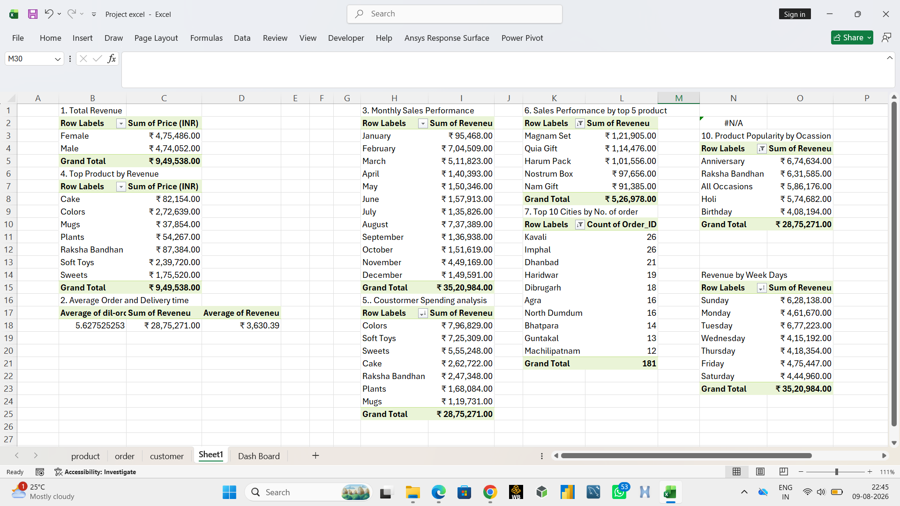

# 📊 Sales Analysis Dashboard in Microsoft Excel

## 📌 Project Overview

This project is an interactive **Sales Analysis Dashboard** created using Microsoft Excel. It provides insights into sales performance, customer purchasing behavior, product revenue, and order trends through interactive visualizations.

The project includes an **Excel analysis sheet with Pivot Tables** and an **interactive dashboard** with KPI cards, charts, and slicers.

---

# 📸 Project Screenshots

## Excel Sales Analysis

The analysis sheet contains Pivot Tables used to calculate and analyze revenue, customer spending, monthly sales, product performance, city-wise orders, occasion-wise revenue, and weekday revenue.



---

## Interactive Sales Dashboard

The dashboard presents the analyzed data using KPI cards, charts, and interactive slicers for easier business decision-making.


---

# 🎯 Project Objectives

- Analyze overall sales performance
- Track total revenue generated
- Identify top-selling products
- Analyze sales by occasion and category
- Monitor weekly and monthly revenue trends
- Understand customer spending behavior
- Identify top-performing cities
- Create an interactive business dashboard

---

# 📂 Dataset

The project contains approximately **1000 order records** and includes multiple related datasets.

### Worksheets

- **Order** – Customer orders and transaction details
- **Product** – Product information
- **Customer** – Customer details
- **Sheet1** – Pivot Tables and helper analysis
- **Dashboard** – Interactive Excel dashboard

---

# 📊 Dashboard KPIs

The dashboard displays the following Key Performance Indicators:

- **Total Orders:** 1000
- **Total Revenue:** ₹35,20,984
- **Average Days Between Order and Delivery:** 5.53 days
- **Average Customer Spending:** ₹3,520.98

---

# 📈 Dashboard Visualizations

### 1. Occasion Revenue - Top 5

Shows the highest revenue-generating occasions.

Top occasions include:

- Anniversary
- Raksha Bandhan
- All Occasions
- Holi
- Birthday

---

### 2. Category Revenue

Displays revenue generated by different product categories.

Categories include:

- Colors
- Soft Toys
- Sweets
- Cake
- Raksha Bandhan
- Plants
- Mugs

---

### 3. Weekly Revenue

Analyzes revenue generated on each day of the week.

This helps identify which days generate higher sales.

---

### 4. Revenue by Month

Shows monthly revenue trends and helps identify seasonal sales patterns.

---

### 5. Top 5 Product Revenue

Displays the products generating the highest revenue.

Top products include:

- Magnam Set
- Quia Gift
- Harum Pack
- Nostrum Box
- Nam Gift

---

### 6. Top 10 Cities by Orders

Ranks cities based on the total number of customer orders.

Top cities include:

- Kavali
- Imphal
- Dhanbad
- Haridwar
- Dibrugarh
- Agra
- North Dumdum
- Bhatpara
- Guntakal
- Machilipatnam

---

# 🎛️ Interactive Filters

The dashboard contains interactive slicers for:

- **Order Date**
- **Delivery Date**
- **Occasion**

Users can select different filters to dynamically update the dashboard visualizations.

---

# 🔍 Excel Analysis

The analysis sheet contains Pivot Tables for:

- Total Revenue
- Average Order and Delivery Time
- Top Products by Revenue
- Monthly Sales Performance
- Customer Spending Analysis
- Top 5 Product Revenue
- Top 10 Cities by Number of Orders
- Product Popularity by Occasion
- Revenue by Weekdays

These calculations form the foundation of the interactive dashboard.

---

# 🛠️ Excel Features Used

- Pivot Tables
- Pivot Charts
- Slicers
- KPI Cards
- Excel Formulas
- Conditional Formatting
- Data Cleaning
- Data Analysis
- Dashboard Design
- Data Visualization
- Interactive Filters

---

# 💡 Business Insights

Using this dashboard, businesses can:

- Monitor overall sales performance
- Compare revenue across different occasions
- Identify high-performing products
- Analyze customer purchasing behavior
- Understand monthly sales trends
- Identify high-demand cities
- Compare weekday revenue
- Support data-driven business decisions

---

# 🧰 Tools Used

- **Microsoft Excel**

---

# 📁 Project Structure

```text
Excel-Sales-Dashboard/
│
├── Dashboard.xlsx
├── sales_analysis.png
├── dashboard.png
└── README.md
